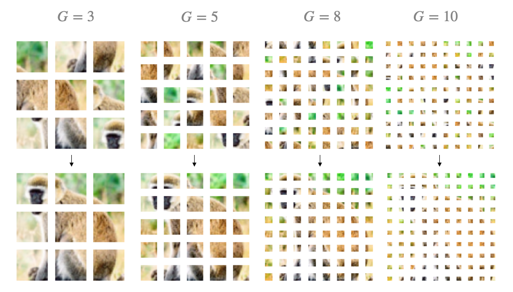
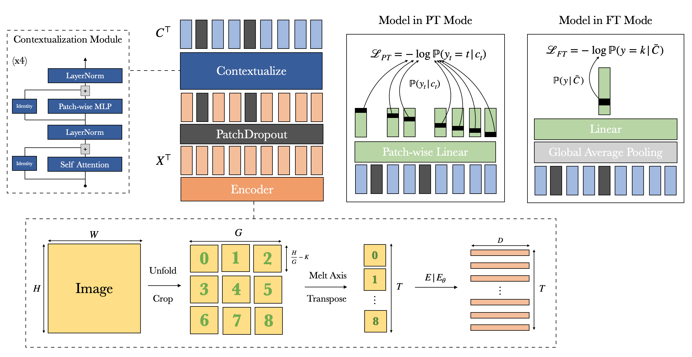

## Transformer Puzzle : Absolute Position Localization (APL-G,K) 

- Powerful contextual image representations can be learned by solving a puzzle task in a fully self supervised manner.
- The obtained representations can be used for downstream tasks, for example image classification.
- In contrast to vision transformers, which require positional embeddings/encodings in order to work well, models pre-trained on APL are competetive in image classification without any additional positional information.

<p align="center">
  
</p>

1. Extract a $G \times G$ grid, yielding a set of $T = G^2$ patches.
2. CenterCrop each of the $T$ patches by $K$ pixels to prevent cheating.
3. Encode the cropped patches by either learning an encoder on the fly or by simply flattening the patches. (The latter is advised)
4. Contextualize the patch encodings by using a stack of off the shelve transformer encoders.
5. For each contextualized patch latent, estimate the true absolute position within the original image using a shared, linear classifier.

<p align="center">
  
</p>


The objective can be solved very efficiently since the true absolute position of any contextualized patch latent $c_t$ is in fact $t$, learning directly from the structure of the data in a truly self supervised fashion. Note that Transformers are permutation equivariant, i.e. they have no access to the sequence dimension $t$, making the collapse into a trivial solution impossible.


### Usage

#### Pre Training

```python
from PreTrainer import Trainer

settings = {
         'COMMENT' : '',
         'G': G,
         'CROP': K,
         'PDO' : 0.1, #"auto",
         "METHOD" : "PLT_MASKED",


         "WEIGHT_DECAY" : 0,
         'LEARNING_RATE': lr,
         'NUM_EPOCHS': 300,#350
         'BATCH_SIZE': B,

         'DROPOUT': 0.15,
         'EMB_DO': 0,
         'ENCODER_DO': 0,
         "N_BLOCKS" : 4,
         "NN_HEAD" : False,
         'PROJECT_PATCH_EMB': False,
         "ENCODER": "MECHANICAL",
         'HIDDEN_MULT': 3,
         'HEADS': H,

         'IMAGE_N': 96,
         'DEVICE': 'cuda:0',
         'SAMPLE': False,
         'SPAWN_TENSORBOARD' : False
    }
    trainer = Trainer(settings)
    trainer.train(continue_training=cont)
```


#### Fine Tuning

```python
from PreTrainer import Tuner

settings = {
           'COMMENT' : "",
           'BENCHMARK' : False,
           'PDO' : 0.1,

          'MODEL_NAME' : '[0.1,7,1]-[0.00115,1024]-[4,16,3,0, 0.15]-[LAST_EXPERIMENT]',
          'HEAD_ONLY' : False,
          'MLP_HEAD'  : False,
          "FREEZE_ENCODER" : False,
          'NUM_EPOCHS': 30,

          'BATCH_SIZE' : 1024,
          'LEARNING_RATE': 0.0005,
          'WEIGHT_DECAY' : 0.0001,
          'DROPOUT'      : 0.1,

          "DEVICE" : "cuda:0",
          'EVAL_EPS' : 2,
          'NPC' : 500, 'rng' : 42,
          'SPAWN_TENSORBOARD' : False,

    }


trainer = Tuner(settings)


trainer.train()
```
